<div align="center">


<a href="https://readme-typing-svg.demolab.com/?font=Fira+Code&size=20&pause=1000&color=58A6FF&center=true&vCenter=true&width=700&height=45&lines=AI+%26+Machine+Learning+Student;Building+Practical+AI+Projects;Exploring+Computer+Vision;Learning+Deep+Learning;Exploring+Generative+AI;Python+%7C+React+%7C+AI+Developer&repeat=true">
  
</a>

<br>

<a href="https://github.com/yashwaje712">
  
</a>
<a href="https://github.com/yashwaje712?tab=repositories">
  
</a>
<a href="https://github.com/yashwaje712?tab=projects">
  
</a>

</div>

---

## 👋 About Me

I'm **Yash Waje**, an AI & Machine Learning student focused on learning by building practical projects.

- 🤖 Machine Learning, Deep Learning & Computer Vision
- 🧠 Exploring modern AI and Generative AI techniques
- 📊 Data analysis, visualization & problem solving
- 🐍 Building projects with Python
- ⚛️ Learning and improving React development
- 🚀 Interested in turning ideas into useful real-world applications

---

## 🛠️ Skills & Technologies

<p align="center">
  
</p>

### AI / Machine Learning


### Web Development


### Tools


---

## 📊 GitHub Analytics

<p align="center">
  
  
</p>

<p align="center">
  
</p>

---

## 📈 Contribution Activity

<p align="center">
  
</p>

---

## 🐍 Contribution Snake

<p align="center">
  <picture>
    <source media="(prefers-color-scheme: dark)" srcset="https://raw.githubusercontent.com/yashwaje712/yashwaje712/output/github-contribution-grid-snake-dark.svg" />
    <source media="(prefers-color-scheme: light)" srcset="https://raw.githubusercontent.com/yashwaje712/yashwaje712/output/github-contribution-grid-snake.svg" />
    
  </picture>
</p>

---

## 🎯 Current Focus

```text
Artificial Intelligence      ███████████████████░  90%
Machine Learning             ██████████████████░░  85%
Computer Vision              ████████████████░░░░  80%
Deep Learning                ███████████████░░░░░  75%
Generative AI                ██████████████░░░░░░  70%
Python                       ███████████████████░  90%
React                        ████████████░░░░░░░░  60%
```

## 🚀 What I'm Building

- 🤖 Machine Learning projects
- 👁️ Computer Vision applications
- 🧠 Deep Learning experiments
- ✨ Generative AI projects
- 🐍 Python-based applications
- ⚛️ React-based web applications
- 🚀 Practical projects focused on real-world problems

---

## 📫 Connect With Me

<div align="center">

<a href="https://github.com/yashwaje712">
  
</a>

</div>

<div align="center">

### 💻 Learn • Build • Experiment • Repeat 🚀


</div>
